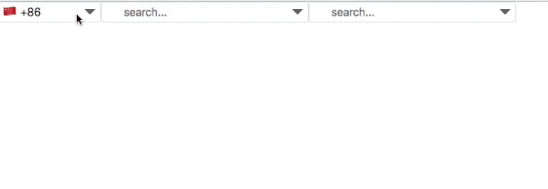

# vue-country-data-select

✨ A selector for country data, such as selecting a calling code

## 效果预览



下拉选项会根据输入进行筛选，匹配 `电话区号`、`地区官方英文名称`、`地区英文简称`

数据包含大部分国家和某些国家的部分地区，如 `Hong Kong`

## 安装方式

``` bash
npm install vue-country-data-select --save
```

``` javascript
import vueCountryDataSelect from 'vue-country-data-select'

Vue.use(vueCountryDataSelect)
```

## 使用方法

``` javascript
<vueCountryDataSelect v-model="input" width="300" height="30"></vueCountryDataSelect>
```

- 无论有无输入，在点击三角形出现下拉列表时，必为完整的列表，但只要改变输入，数据会自动筛选
- 支持 `v-model` 语法糖
- `width` 和 `height` 必填
- 选填项 `mode` 可切换至`输出地区电话区号`模式，以后会继续添加功能
- `placeholder`: 输入提示信息

``` javascript
<vueCountryDataSelect
  v-model="input" width="200" height="30" mode="countryCallingCodes">
</vueCountryDataSelect>
```

## 数据来源

[country-data](https://github.com/OpenBookPrices/country-data)